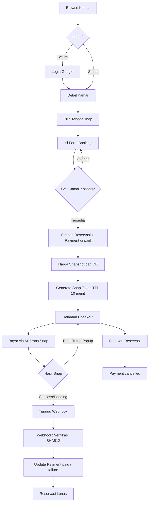
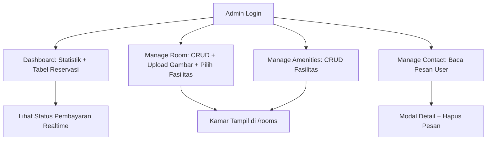
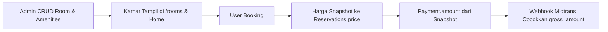

# Booking Hotel — HotelF

Aplikasi **pemesanan hotel** berbasis web untuk mencari kamar dan memesan secara online dengan pembayaran real via **Midtrans Snap**. Sistem ini memisahkan peran **user** (tamu) dan **admin** (pengelola hotel), dengan alur pemesanan dari browsing kamar hingga konfirmasi pembayaran.

Dibangun sebagai project pembelajaran/portfolio dengan fokus pada reservasi anti double-booking, payment gateway, dan panel administrasi.

---

## Tech Stack

| Layer               | Teknologi                                             |
| ------------------- | ----------------------------------------------------- |
| Framework           | Next.js 16.3.5 (App Router, Server Components)        |
| Frontend            | React 19, TypeScript (strict)                         |
| Styling             | Tailwind CSS v4 (`@theme` di `app/globals.css`)       |
| Database            | PostgreSQL (Neon) via Prisma 7 + `@prisma/adapter-pg` |
| Auth                | NextAuth v5 (Google OAuth, JWT strategy, role-based)  |
| Payment gateway     | Midtrans Snap (sandbox)                               |
| File storage        | Vercel Blob (upload gambar kamar)                     |
| Validation & forms  | zod, Server Actions (`useActionState`)                |
| Icons & utility     | react-icons, clsx, date-fns, react-datepicker         |

---

## Fitur Utama

### Halaman Publik (Tanpa Login)

| Fitur              | Keterangan                                                                                                     |
| ------------------ | -------------------------------------------------------------------------------------------------------------- |
| **Home**           | Hero section, daftar kamar featured, CTA ke katalog                                                             |
| **Rooms**          | Daftar kamar dengan pagination dan pencarian nama                                                               |
| **Room Detail**    | Galeri gambar, harga/malam, deskripsi, fasilitas kamar, date-picker dengan tanggal terpesan/batal, form booking |
| **About**          | Informasi hotel                                                                                                 |
| **Contact**        | Form kirim pesan ke database untuk dibaca admin                                                                 |
| **Login**          | Login Google OAuth (tanpa register manual)                                                                      |

### User (Login Required)

| Fitur              | Keterangan                                                                                                              |
| ------------------ | ----------------------------------------------------------------------------------------------------------------------- |
| **Booking**        | Pilih tanggal inap, validasi zod, cek kamar kosong (overlap) dalam `$transaction`, harga di-snapshot dari DB             |
| **Checkout**       | Ringkasan reservasi + kwitansi, tombol bayar memanggil Snap (`window.snap.pay`)                                         |
| **My Reservation** | Daftar reservasi dengan badge status, pagination, aksi Bayar/Lihat Detail                                                |
| **Reservation Detail** | Kwitansi lengkap (ID, tamu, kamar, durasi, total, metode & status bayar)                                            |
| **Cancel**         | Batalkan reservasi yang belum lunas (status `cancelled`) dengan konfirmasi                                               |

### Admin (Role `admin`)

| Modul               | Keterangan                                                                       |
| ------------------- | -------------------------------------------------------------------------------- |
| **Dashboard**       | Statistik (total reservasi, kamar, pendapatan, pengguna) + tabel reservasi + search |
| **Manage Room**     | CRUD kamar (nama, deskripsi, harga, kapasitas, gambar via Vercel Blob, multi-amenities), search + pagination |
| **Manage Amenities**| CRUD fasilitas — ditolak jika masih dipakai kamar                                |
| **Manage Contact**  | Daftar pesan dari form contact, modal detail, hapus, search + pagination          |

### Manajemen Status Pembayaran

Alur status yang didukung:

`unpaid` → `paid` (webhook `settlement`/`capture accept`)

atau `failure` (webhook `deny`/`expire`/`cancel`/`refund`), atau `cancelled` (dibatalkan user sebelum lunas). Setelah `paid`, replay notification yang menurunkan status diblokir kecuali refund/cancel.

---

## Alur Proses Bisnis Sistem

### 1. Alur User (Booking & Pembayaran)



### 2. Alur Admin (Manajemen)



### 3. Alur Data Reservasi



> **Catatan:** Harga dipesan di-*snapshot* ke tabel `Reservations.price` saat booking, sehingga total tagihan tetap akurat meskipun harga kamar diubah admin kemudian. Webhook Midtrans memverifikasi `gross_amount` terhadap snapshot yang sama.

---

## Kelebihan Project

1. **Anti double-booking** — Cek kamar kosong (overlap) dilakukan dalam satu `$transaction` Prisma sehingga dua pemesanan serentak tidak bisa bentrok.
2. **Anti-tamper harga** — Harga booking diambil dari database, bukan dari client; total pembayaran selalu konsisten.
3. **Payment gateway real** — Integrasi Midtrans Snap (sandbox): token di-cache di DB (TTL 10 menit), webhook dengan signature SHA512 + `timingSafeEqual` + guard replay.
4. **Role-based access** — `proxy.ts` + `authorized` callback: `/reservation` & `/checkout` wajib login, `/admin/*` wajib `role === "admin"`, data user hanya bisa diakses pemiliknya.
5. **Snapshot reservasi** — Kwitansi tetap akurat meskipun kamar diedit/dihapus (kamar soft-relation via snapshot harga).
6. **UI konsisten Bahasa Indonesia** — Kartu putih `rounded-2xl`, primary orange `#f97316`, format rupiah `toLocaleString('id-ID')`, badge status berwarna di semua halaman.
7. **Admin lengkap** — CRUD kamar dengan upload gambar (Vercel Blob) & multi-amenities, guard relasi (fasilitas terpakai tidak bisa dihapus), search + pagination di semua tabel.
8. **Date-picker pintar** — Tanggal yang sudah terpesan/gagal/batal dikeluarkan dari kalender, mencegah bentrok sejak di UI.

---

## Kekurangan & Keterbatasan

1. **Verifikasi live webhook tertunda** — Signature sudah sesuai format Midtrans (SHA512 plain), tetapi notifikasi live dari dashboard belum diverifikasi ulang lewat ngrok.
2. **Newsletter footer tidak fungsional** — Form subscribe di footer hanya `preventDefault()`, belum tersimpan ke mana pun.
3. **Peta lokasi placeholder** — Halaman contact menampilkan kotak "Peta Lokasi", belum embed Google Maps.
4. **Tanpa notifikasi email** — Booking/pembayaran/pembatalan hanya tampil di UI, tidak dikirim via email.
5. **Filter kamar terbatas** — Baru pencarian nama; belum filter harga/kapasitas/fasilitas.
6. **Dashboard admin tanpa grafik** — Statistik berupa angka & tabel, belum ada chart visual.
7. **Tanpa manajemen user** — Role admin di-set manual di database; belum ada UI kelola user/role.
8. **Konfigurasi sandbox hard-coded** — `isProduction: false` dan URL `snap.js` sandbox masih hard-coded; harus diganti bersamaan saat deploy produksi.
9. **Tanpa rate limit** — Endpoint `/api/payment` belum dibatasi jumlah request per user.

---

## Struktur Folder Penting

```
app/
├── page.tsx              # Homepage (Hero + kamar featured)
├── rooms/                # Daftar kamar + detail (booking)
├── reservation/          # List & detail reservasi (kwitansi)
├── checkout/[id]/        # Halaman checkout + Snap
├── admin/
│   ├── dashboard/        # Statistik + tabel reservasi
│   ├── manage-room/      # CRUD kamar (+ create, [id]/edit)
│   ├── manage-amenities/ # CRUD fasilitas (+ create, [id]/edit)
│   └── manage-contact/   # Pesan dari form contact
├── api/
│   ├── payment/          # Terbitkan Snap token
│   ├── payment/notification/ # Webhook Midtrans (SHA512)
│   ├── upload/           # Upload gambar ke Vercel Blob
│   └── [...nextauth]/    # NextAuth handler
├── login/                # Login Google (layout khusus)
├── contact/, about/      # Form kontak & info hotel
├── generated/prisma/     # Generated client (gitignored)
lib/
├── action.ts             # Semua Server Actions
├── data.ts               # Data fetchers (guarded)
├── midtrans.ts           # Snap token creator
├── zod.ts                # Skema validasi
└── prisma.ts, utils.ts
components/               # UI (checkout, reservation, admin, skeleton)
prisma/schema.prisma      # Skema DB + migrations
proxy.ts                  # Middleware (NextAuth authorized)
auth.ts, auth.config.ts   # Konfigurasi NextAuth
types/                    # Type bersama + ambient globals
```

---

## Instalasi & Menjalankan Project

### Prasyarat

- Node.js >= 20
- PostgreSQL (atau akun Neon)
- Akun [Google Cloud Console] (OAuth Client ID)
- Akun [Midtrans](https://midtrans.com) (mode Sandbox) — Server Key + Client Key
- Akun [Vercel Blob](https://vercel.com/blob) (token)

### Langkah

```bash
# Clone & masuk folder project
cd booking-hotel

# Install dependency
npm install

# Salin environment lalu isi nilai-nilainya
cp .env.example .env
```

Isi `.env`:

```bash
# NextAuth
AUTH_SECRET=
AUTH_GOOGLE_ID=          # Google OAuth Client ID
AUTH_GOOGLE_SECRET=      # Google OAuth Client Secret

# Database (Neon / PostgreSQL)
POSTGRES_URL=

# Midtrans (Sandbox)
MIDTRANS_SERVER_KEY=
NEXT_PUBLIC_MIDTRANS_CLIENT_KEY=

# Vercel Blob
BLOB_READ_WRITE_TOKEN=
```

```bash
# Sinkronkan skema DB + generate client
npx prisma db push
npx prisma generate

# Jalankan server
npm run dev
```

Buka browser: `http://localhost:3000`

> **Catatan:** Tidak ada akun demo — login hanya via Google. Untuk masuk sebagai admin, ubah kolom `role` user menjadi `"admin"` di database (tabel `User`).

---

## Route Penting

| URL                              | Deskripsi                          |
| -------------------------------- | ---------------------------------- |
| `/`                              | Homepage                           |
| `/rooms`                         | Daftar kamar (search + pagination) |
| `/rooms/[id]`                    | Detail kamar + form booking        |
| `/login`                         | Login Google                       |
| `/reservation`                   | Daftar reservasi user              |
| `/reservation/[id]`              | Detail kwitansi reservasi          |
| `/checkout/[id]`                 | Checkout + pembayaran Snap         |
| `/contact`                       | Form kontak                        |
| `/about`                         | Tentang hotel                      |
| `/admin/dashboard`               | Panel admin: statistik             |
| `/admin/manage-room`             | CRUD kamar                         |
| `/admin/manage-amenities`        | CRUD fasilitas                     |
| `/admin/manage-contact`          | Pesan dari user                    |
| `/api/payment`                   | Terbitkan Snap token (POST)        |
| `/api/payment/notification`      | Webhook Midtrans                   |
| `/api/upload`                    | Upload gambar (admin)              |

---

## Model Relasi (Ringkas)

```
User ──┬── Accounts (Google OAuth)
       ├── Reservations ── Payment (1:1, status: unpaid/paid/failure/cancelled)
       │        └── Rooms
       └── role: "user" | "admin"

Rooms ──┬── RoomAmenities ── Amenities
        └── Reservations (price di-snapshot ke Reservations.price)

contact ── Pesan dari form contact (dibaca admin)
```

---

## Roadmap / Pengembangan Lanjutan

- Verifikasi notifikasi live Midtrans lewat ngrok
- Newsletter footer aktif (simpan email subscriber)
- Embed Google Maps di halaman contact
- Filter kamar: harga, kapasitas, fasilitas
- Notifikasi email (booking, lunas, dibatalkan)
- Grafik/chart di dashboard admin
- Manajemen user & role di panel admin
- Konfigurasi Midtrans produksi via environment variable
- Rate limit endpoint `/api/payment`

---

## Referensi Desain

Desain UI/UX orisinal — tanpa template eksternal, menggunakan bahasa desain yang dikembangkan sendiri (kartu putih, primary orange `#f97316`, layout responsive Tailwind CSS).
